* This repository contains detailed instructions for deploying AWX via docker-compose. For any additional details or inquiries, please contact us at christopher.sargent@sargentwalker.io.
* [AWX Project Page](https://github.com/ansible/awx)
* Note AWX is the opensourced Ansible Automation Platform
* [Ansible Automation Plaform](https://www.redhat.com/en/technologies/management/ansible)

# Railhead vCheck
* Running from my Desktop with WSL, Powershell and Powershell ISE
1. cd /mnt/c/Users/CAS/Desktop/Railhead2024/projects/
2. git clone git@github.com:ChristopherSargent/railhead_vCheck.git
3. cd railhead_vCheck
4. vim GlobalVariables.ps1
```
# You can change the following defaults by altering the below settings:

# Set the following to true to enable the setup wizard for first time run
$SetupWizard = $true

# Start of Settings
# Report header
$reportHeader = "vCheck"
# Would you like the report displayed in the local browser once completed ?
$DisplaytoScreen = $true
# Display the report even if it is empty?
$DisplayReportEvenIfEmpty = $true
# Use the following item to define if an email report should be sent once completed
$SendEmail = $True
# Please Specify the SMTP server address (and optional port) [servername(:port)]
$SMTPSRV = "184.94.220.216"
# Would you like to use SSL to send email?
$EmailSSL = $false
# Please specify the email address who will send the vCheck report
$EmailFrom = "christopher.sargent@railhead.io"
# Please specify the email address(es) who will receive the vCheck report (separate multiple addresses with comma)
$EmailTo = "christopher.sargent@railhead.io"
# Please specify the email address(es) who will be CCd to receive the vCheck report (separate multiple addresses with comma)
$EmailCc = "christopher.sargent@railhead.io"
# Please specify an email subject
$EmailSubject = "$ Railhead vCheck Report"
# Send the report by e-mail even if it is empty?
$EmailReportEvenIfEmpty = $true
# If you would prefer the HTML file as an attachment then enable the following:
$SendAttachment = $True
# Set the style template to use.
$Style = "Clarity"
# Do you want to include plugin details in the report?
$reportOnPlugins = $true
# List Enabled plugins first in Plugin Report?
$ListEnabledPluginsFirst = $true
# Set the following setting to $true to see how long each Plugin takes to run as part of the report
$TimeToRun = $true
# Report on plugins that take longer than the following amount of seconds
$PluginSeconds = 30
# End of Settings

# End of Global Variables

```
5. vim Encrypted_Creds.ps1
```
#STORED CREDENTIAL CODE
$Domain = Read-Host "Enter Domain Name"
$AdminName = Read-Host "Enter your UserName"
$CredsFile = "C:\Users\cas\Desktop\Railhead2024\projects\railhead_vCheck\Password\$AdminName-PowershellCreds.txt"
$FileExists = Test-Path $CredsFile
if ($Domain -eq "") {
$Username = $AdminName
}
else {
$Username = $Domain+"\"+$AdminName
}
if  ($FileExists -eq $false) {
    Write-Host 'Credential file not found. Enter your password:' -ForegroundColor Red
    Read-Host -AsSecureString | ConvertFrom-SecureString | Out-File $CredsFile
    $password = get-content $CredsFile | convertto-securestring
    $Cred = new-object -typename System.Management.Automation.PSCredential -argumentlist $Username,$password}
else
    {Write-Host 'Using your stored credential file' -ForegroundColor Green
	Read-Host "Enter your new password" -AsSecureString | ConvertFrom-SecureString | Out-File $CredsFile
    $password = get-content $CredsFile | convertto-securestring
    $Cred = new-object -typename System.Management.Automation.PSCredential -argumentlist $Username,$password}
```
6. vim Plugins/'00 Initialize'/'00 Connection Plugin for vCenter.ps1'
* Update the following
```
$fldr2 = "C:\Users\cas\Desktop\Railhead2024\\projects\railhead_vCheck\Password\"
$Server = "rdu1-vcenter.mgmt.adtihosting.com"

$VC_User = "rhcs@mgmt.adtihosting.com"
```
# Install powerCLI
1. Open administrator powershell window
2. Get-Module VMware.PowerCLI -ListAvailable | Uninstall-Module -Force
3. Find-Module powershellget | Install-Module
* Select Y
4. Install-Module -Name PowerShellGet -Force
5. Get-Module powershellget -ListAvailable
```
    Directory: C:\Program Files\WindowsPowerShell\Modules


ModuleType Version    Name                                ExportedCommands
---------- -------    ----                                ----------------
Script     2.2.5      PowerShellGet                       {Find-Command, Find-DSCResource, Find-Module, Find-RoleCap...
Script     1.0.0.1    PowerShellGet                       {Install-Module, Find-Module, Save-Module, Update-Module...}
```
6. File explorer C:\Program Files\WindowsPowerShell\Modules\PowerShellGet

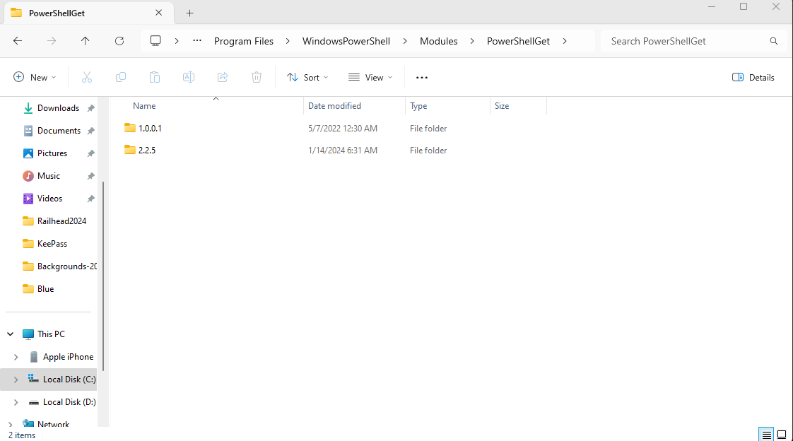

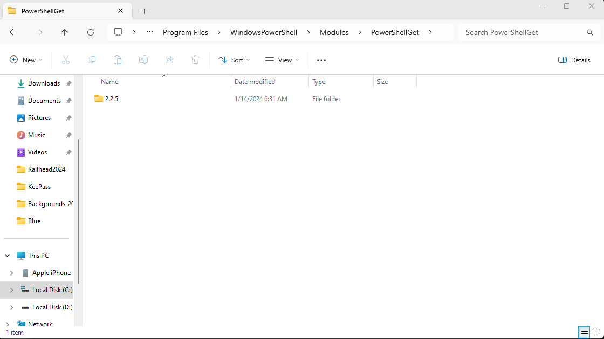

7. Get-Module packagemanagement -ListAvailable
```
    Directory: C:\Program Files\WindowsPowerShell\Modules


ModuleType Version    Name                                ExportedCommands
---------- -------    ----                                ----------------
Script     1.4.8.1    PackageManagement                   {Find-Package, Get-Package, Get-PackageProvider, Get-Packa...
Binary     1.0.0.1    PackageManagement                   {Find-Package, Get-Package, Get-PackageProvider, Get-Packa...
```

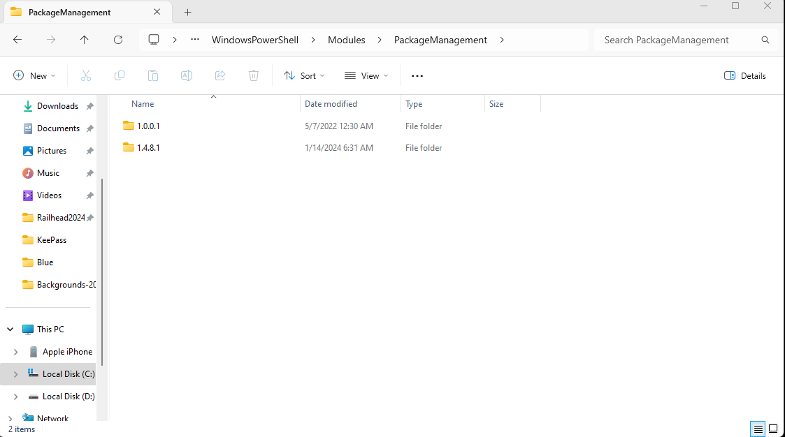

8. Close powershell window and then delete old version
9. Open powershell ISE as admin 
10. Set-ExecutionPolicy RemoteSigned 
11. Import-Module PowerShellGet
12. Install-Module -Name VMware.PowerCLI 
13. New-Item -Path $Profile -ItemType file -Force
* To ensure that powercli starts when you open ISE
14. notepad $profile
15. Import-Module VMware.PowerCLI
* Save 

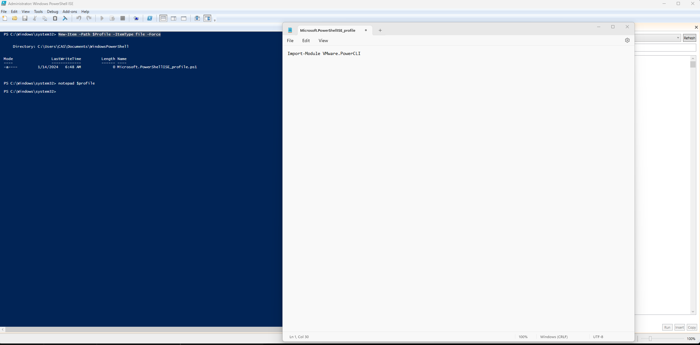

16. Set-PowerCLIConfiguration -Scope AllUsers -ParticipateInCeip $false -InvalidCertificateAction Ignore
* Select Yes to All

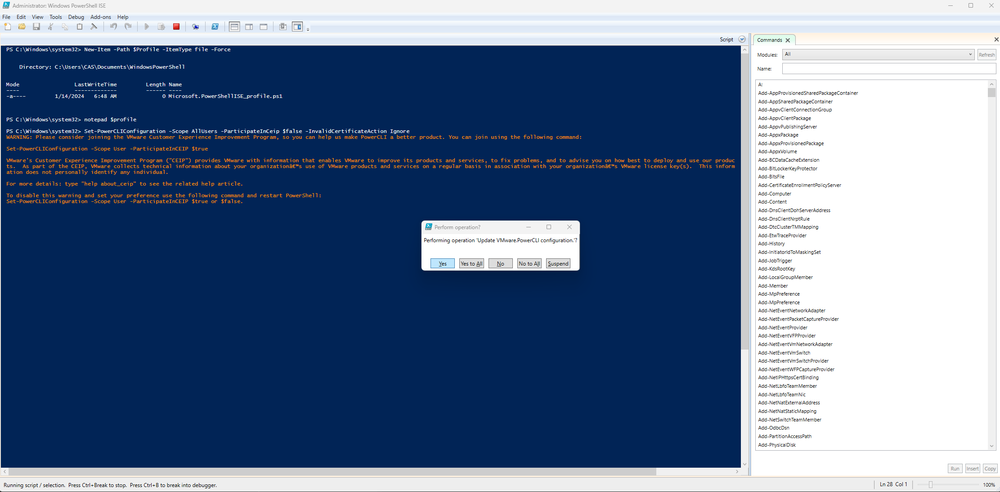

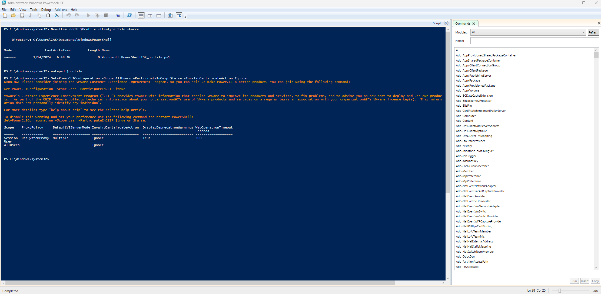

17. Close and reopen powersheel ISE as Admin 
* Note it should start powerCLI now

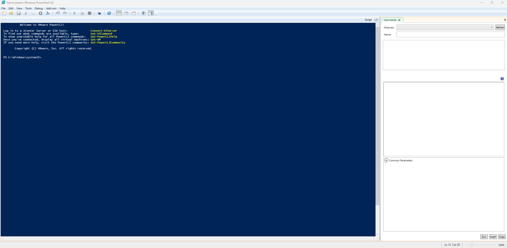

18. Browse to C:\Users\CAS\Desktop\Railhead2024\projects\railhead_vCheck\Encrypted_Creds.ps1 > Play 
* Note to just hit enter for domain name but add your user under UserName = rhcs@mgmt.adtihosting.com which prompts you for your password

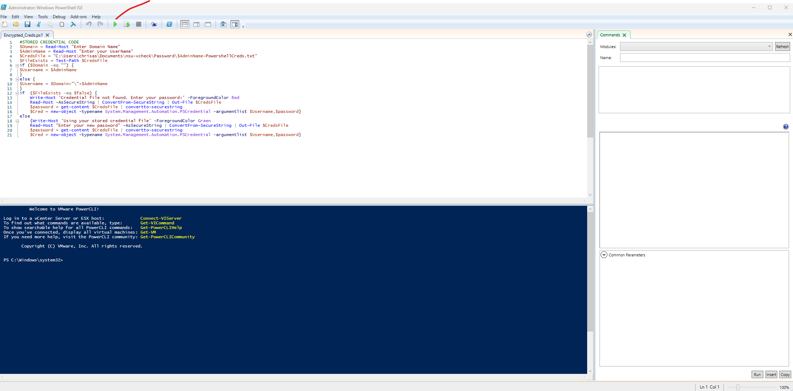

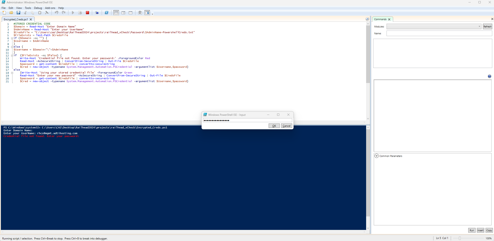

19. Browse to C:\Users\CAS\Desktop\Railhead2024\projects\railhead_vCheck\vCheck.ps1 > Play

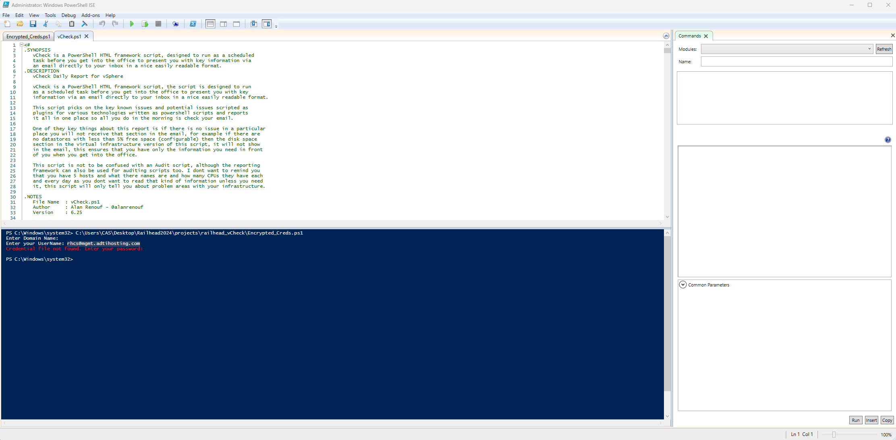

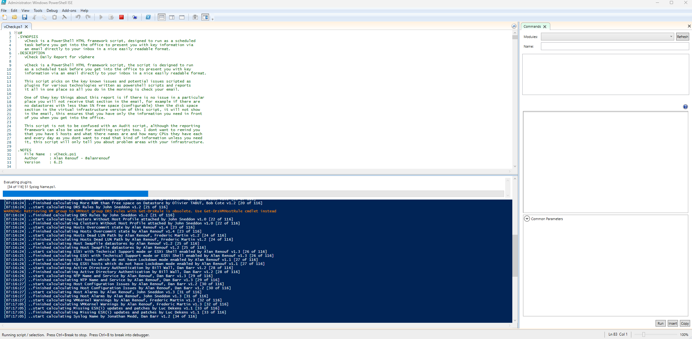

